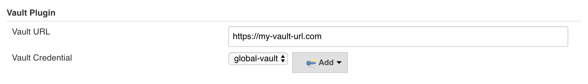
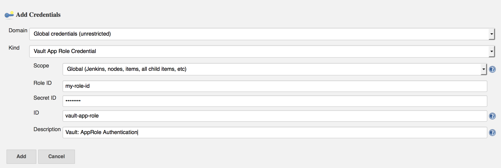
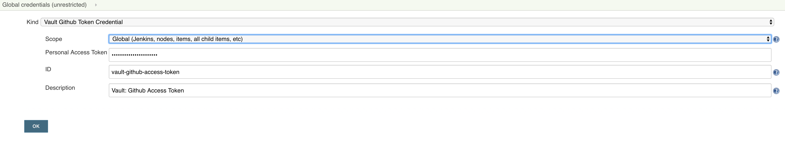
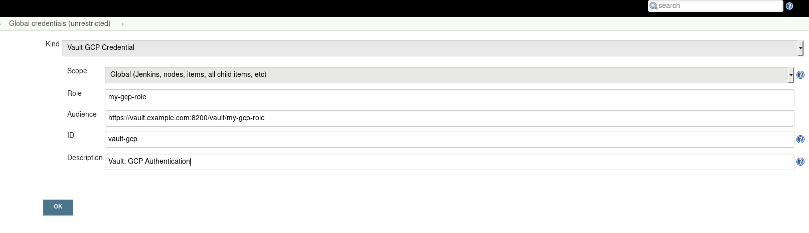
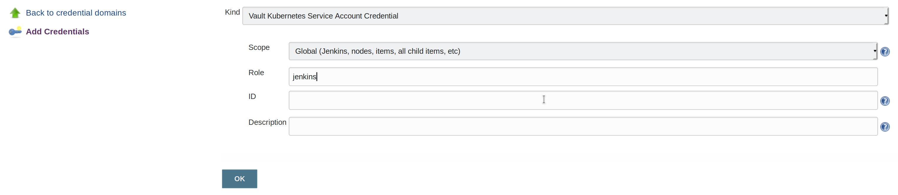
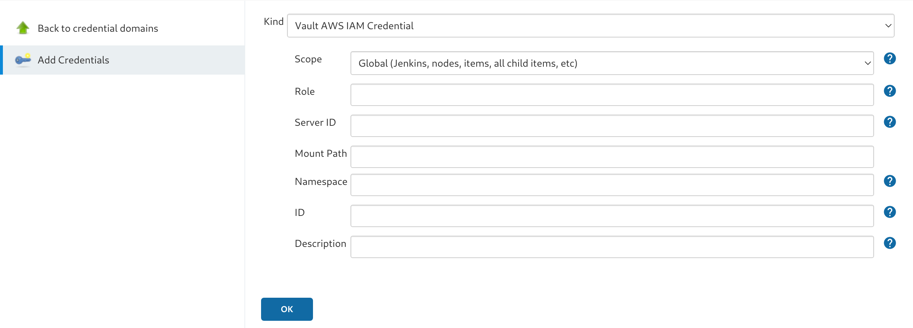
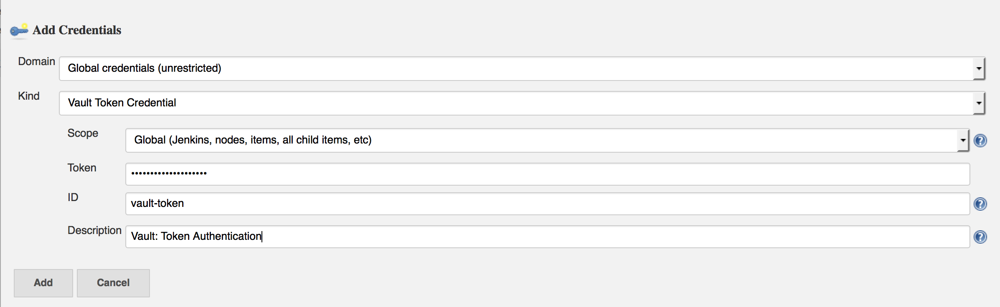
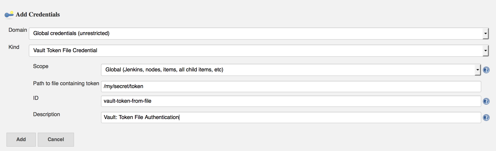
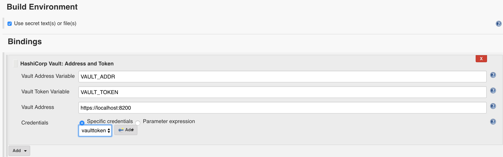

# Jenkins Vault Plugin

[](https://ci.jenkins.io/job/Plugins/job/hashicorp-vault-plugin/job/master/)
[](https://plugins.jenkins.io/hashicorp-vault-plugin)
[](https://github.com/jenkinsci/hashicorp-vault-plugin/releases/latest)
[](https://plugins.jenkins.io/hashicorp-vault-plugin)

This plugin adds a build wrapper to set environment variables from a HashiCorp [Vault](https://www.vaultproject.io/) secret. Secrets are generally masked in the build log, so you can't accidentally print them.  
It also has the ability to inject Vault credentials into a build pipeline or freestyle job for fine-grained vault interactions.

## Vault Authentication Backends
This plugin allows authenticating against Vault using the AppRole authentication backend. Hashicorp recommends using AppRole for Servers / automated workflows (like Jenkins) and using Tokens (default mechanism, Github Token, ...) for every developer's machine.
  Furthermore, this plugin allows using a Github personal access token, or a Vault Token - either configured directly in Jenkins or read from an arbitrary file on the Jenkins controller.

### How does AppRole work?
In short: you register an approle auth backend using a self-chosen name (e.g. Jenkins). This approle is identified by a `role-id` and secured with a `secret_id`. If you have both of those values you can ask Vault for a token that can be used to access vault.
When registering the approle backend you can set a couple of different parameters:
* How long should the `secret_id` live (can be indefinite)
* how often can one use a token that is obtained via this backend
* which IP addresses can obtain a token using `role-id` and `secret-id`?
* many more

This is just a short introduction, please refer to [Hashicorp itself](https://www.vaultproject.io/docs/auth/approle.html) to get detailed information.
### What about other backends?
Hashicorp explicitly recommends the AppRole Backend for machine-to-machine authentication. Token based auth is mainly supported for backward compatibility.
Other backends that might make sense are the AWS EC2 backend, the Azure backend, and the Kubernetes backend. But we do not support these yet. Feel free to contribute!

Implementing additional authentication backends is actually quite easy:

Simply provide a class extending `AbstractVaultTokenCredential` that contains a `Descriptor` extending `BaseStandardCredentialsDescriptor`.
The `Descriptor` needs to be annotated with `@Extension`. Your credential needs to know how to authenticate with Vault and provide an authenticated Vault session.
See [VaultAppRoleCredential.java](https://github.com/jenkinsci/hashicorp-vault-plugin/blob/master/src/main/java/com/datapipe/jenkins/vault/credentials/VaultAppRoleCredential.java) for an example.


## Plugin Usage
### Configuration
You can configure the plugin on three different levels:
* Global: in your global config
* [Folder](https://wiki.jenkins-ci.org/display/JENKINS/CloudBees+Folders+Plugin)-Level: on the folder your job is running in
* Job-Level: either on your freestyle project job or directly in the Jenkinsfile

The lower the level the higher its priority, meaning: if you configure a URL in your global settings, but override it in your particular job, this URL will be used for communicating with Vault.
In your configuration (may it be global, folder or job) you see the following screen:


The credential you provide determines what authentication backend will be used.
Currently, there are five different Credential Types you can use:

#### Vault App Role Credential



You enter your `role-id` and `secret-id` there. The description helps to find your credential later, the id is not mandatory (a UUID is generated by default), but it helps to set it if you want to use your credential inside the Jenkinsfile.

The `path` field is the approle authentication path. This is, by default, "approle" and this will also be used if no path is specified here.

#### Migrate current Jenkins Vault configuration to support a new version of plugin.
After update a plugin from version `2.2.0` you can note - builds failed with an exception `java.lang.NullPointerException`. These steps will help you fix it:
1. If you using AppRole auth method - you need to update Jenkins `Credential` store (in UI) for all kinds `Vault App Role Credential` and set `Path` field for your correct path or just leave the default `approle` and save. 
2. Go to `Configure` of failed job and change Vault Engine in `Advanced Settings` and choose your version on KV Engine 1 or 2 from a select menu `K/V Engine Version` for ALL `Vault Secrets` and save.

#### Vault Github Credential



You enter your github personal access token to authenticate to vault.

#### Vault GCP Credential



You enter your Vault GCP auth `role` name and `audience`. The JWT will be automatically retrieved from GCE metdata. This requires that Jenkins master is running on a GCE instance.

#### Vault Kubernetes Credential



You enter your Vault Kubernetes auth `role`. The JWT will be automatically retrieved from the
mounted secret volume (`/var/run/secrets/kubernetes.io/serviceaccount/token`). This assumes,
that the jenkins is running in Kubernetes Pod with a Service Account attached.

#### Vault AWS IAM Credential



Authenticate to Vault using the aws auth method with the
[IAM](https://www.vaultproject.io/docs/auth/aws#iam-auth-method)
workflow. The AWS credentials will be automatically retrieved from one
of [several standard
locations](https://docs.aws.amazon.com/AWSJavaSDK/latest/javadoc/com/amazonaws/auth/DefaultAWSCredentialsProviderChain.html).
The typical use case would be Jenkins master running on an AWS EC2
instance with the credentials acquired from the [instance
metadata](https://docs.aws.amazon.com/AWSEC2/latest/UserGuide/iam-roles-for-amazon-ec2.html#instance-metadata-security-credentials).
Optionally enter your AWS IAM auth `role` name and Vault AWS auth
`mount` path. If the `role` is not provided, Vault will determine it
from the principal in the IAM identity. If the `mount` path is not
provided, it defaults to `aws`.

#### Vault Token Credential



Directly specify a token to be used when authenticating with vault.

#### Vault Token File Credential



Basically the same as the Vault Token Credential, just that the token is read from a file on your Jenkins Machine.
You can use this in combination with a script that periodically refreshes your token.

### Usage in FreeStyle Jobs
If you still use free style jobs (hint: you should consider migrating to [Jenkinsfile](https://jenkins.io/doc/book/pipeline/)), you can configure both configuration and the secrets you need on the job level.


The secrets are available as environment variables then.

### Usage via Jenkinsfile
Let the code speak for itself:
```groovy
node {
    // define the secrets and the env variables
    // engine version can be defined on secret, job, folder or global.
    // the default is engine version 2 unless otherwise specified globally.
    def secrets = [
        [path: 'secret/testing', engineVersion: 1, secretValues: [
            [envVar: 'testing', vaultKey: 'value_one'],
            [envVar: 'testing_again', vaultKey: 'value_two']]],
        [path: 'secret/another_test', engineVersion: 2, secretValues: [
            [vaultKey: 'another_test']]]
    ]

    // optional configuration, if you do not provide this the next higher configuration
    // (e.g. folder or global) will be used
    def configuration = [vaultUrl: 'http://my-very-other-vault-url.com',
                         vaultCredentialId: 'my-vault-cred-id',
                         engineVersion: 1]
    // inside this block your credentials will be available as env variables
    withVault([configuration: configuration, vaultSecrets: secrets]) {
        sh 'echo $testing'
        sh 'echo $testing_again'
        sh 'echo $another_test'
    }
}
```
In the future we might migrate to a [BuildStep](http://javadoc.jenkins-ci.org/hudson/tasks/BuildStep.html) instead of a BuildWrapper.

#### Use of dynamic credentials

You may also want to use dynamically allocated credentials:
```groovy
import hudson.util.Secret
import com.cloudbees.plugins.credentials.CredentialsScope
import com.datapipe.jenkins.vault.credentials.VaultTokenCredential

VaultTokenCredential customCredential = new VaultTokenCredential(
    CredentialsScope.GLOBAL,
    'custom-credential',
    'My Custom Credential',
    Secret.fromString('This is my token. There are many like it, but this one is mine. My token is my best friend.')
)

node {
...
    def configuration = [vaultUrl: 'http://my-very-other-vault-url.com',
                         vaultCredential: customCredential]
...
```

Setting a `vaultCredential` will override any previously defined `vaultCredentialId`.

Works with any `VaultCredential`: `VaultTokenCredential`, `VaultAppRoleCredential`, etc.

## Inject Vault Credentials into your Job
### Pipeline Usage


Specify the variables for the vault address and token.  Vault Address and Credentials are both required.  
`addrVariable` and `tokenVariable` are optional.  They will be set to `VAULT_ADDR` and `VAULT_TOKEN` respectively if omitted.

```groovy
node {
    withCredentials([[$class: 'VaultTokenCredentialBinding', credentialsId: 'vaulttoken', vaultAddr: 'https://localhost:8200']]) {
        // values will be masked
        sh 'echo TOKEN=$VAULT_TOKEN'
        sh 'echo ADDR=$VAULT_ADDR'
    }
}
```

### FreeStyle Job


## Configuration as Code
There is an easier way to setup the global Vault configuration on your Jenkins server.  
No need for messing around in the UI.  

Jenkins Configuration as Code often shorten to [JCasC] or simplify [Configuration as Code plugin]
allows you to configure Jenkins via a yaml file. If you are a first time user, you can learn more about [JCasC] :point_left:

Hashicorp Plugin also adds an extension to [JCasC] by providing a Secret Source for [Configuration as Code plugin] to read secrets from, which you can [read about here](#hashicorp-vault-plugin-as-a-secret-source-for-jcasc)

### Prerequisite: 

Install `Configuration as Code` Plugin on your Jenkins instance.

Refer to [Installing a new plugin in Jenkins](https://jenkins.io/doc/book/managing/plugins/#installing-a-plugin).

#### Add configuration YAML:

There are multiple ways to load JCasC yaml file to configure Jenkins:

* JCasC by default searches for a file with the name `jenkins.yaml` in `$JENKINS_ROOT`.

* The JCasC looks for an environment variable `CASC_JENKINS_CONFIG` which contains the path for the configuration `yaml` file.

    * A path to a folder containing a set of config files e.g. `/var/jenkins_home/casc_configs`.

    * A full path to a single file e.g. `/var/jenkins_home/casc_configs/jenkins.yaml`.

    * A URL pointing to a file served on the web e.g. `https://<your-domain>/jenkins.yaml`.

* You can also set the configuration yaml path in the UI. Go to `<your-jenkins-domain>/configuration-as-code`. Enter path or URL to `jenkins.yaml` and select `Apply New Configuration`.

To configure your Vault in Jenkins add the following to `jenkins.yaml`:

```yaml
unclassified:
  hashicorpVault:
    configuration:
      vaultCredentialId: "vaultToken"
      vaultUrl: "https://vault.company.io"

credentials:
  system:
    domainCredentials:
      - credentials:
          - vaultTokenCredential:
              description: "Uber Token"
              id: "vaultToken"
              scope: GLOBAL
              token: "${MY_SECRET_TOKEN}"
```

See [handling secrets section](https://github.com/jenkinsci/configuration-as-code-plugin/blob/master/docs/features/secrets.adoc) in JCasC documentation for better security.

You can also configure `VaultGithubTokenCredential`, `VaultGCPCredential`, `VaultAppRoleCredential` or `VaultAwsIamCredential`.

If you are unsure about how to do it from `yaml`. You can still use the UI to configure credentials.  
After you configured Credentials and the Global Vault configuration.  
you can use the export feature build into JCasC by visiting `<your-jenkins-domain>/configuration-as-code/viewExport` 

### HashiCorp Vault Plugin as a Secret Source for JCasC

We can provide these initial secrets for JCasC.
The secret source for JCasC is configured via environment variables as way to get access to vault at startup and when configuring Jenkins instance.

[For Security and compatibility considerations please read more here](https://github.com/jenkinsci/configuration-as-code-plugin#security-and-compatibility-considerations)

- The environment variable `CASC_VAULT_PW` must be present, if token is not used and appRole/Secret is not used. (Vault password.)
- The environment variable `CASC_VAULT_USER` must be present, if token is not used and appRole/Secret is not used. (Vault username.)
- The environment variable `CASC_VAULT_APPROLE` must be present, if token is not used and U/P not used. (Vault AppRole ID.)
- The environment variable `CASC_VAULT_APPROLE_SECRET` must be present, if token is not used and U/P not used. (Vault AppRole Secret ID.)
- The environment variable `CASC_VAULT_KUBERNETES_ROLE` must be present, if you want to use Kubernetes Service Account. (Vault Kubernetes Role.)
- The environment variable `CASC_VAULT_AWS_IAM_ROLE` must be present, if you want to use AWS IAM authentiation. (Vault AWS IAM Role.)
- The environment variable `CASC_VAULT_AWS_IAM_SERVER_ID` must be present when using AWS IAM authentication and the Vault auth method requires a value for the `X-Vault-AWS-IAM-Server-ID` header. (Vault AWS IAM Server ID.)
- The environment variable `CASC_VAULT_TOKEN` must be present, if U/P is not used. (Vault token.)
- The environment variable `CASC_VAULT_PATHS` must be present. (Comma separated vault key paths. For example, `secret/jenkins,secret/admin`.)
- The environment variable `CASC_VAULT_URL` must be present. (Vault url, including port number.)
- The environment variable `CASC_VAULT_AGENT_ADDR` is optional. It takes precedence over `CASC_VAULT_URL` and is used for connecting to a Vault Agent. [See this section](#vault-agent)
- The environment variable `CASC_VAULT_MOUNT` is optional. (Vault auth mount. For example, `ldap` or another username & password authentication type, defaults to `userpass`.)
- The environment variable `CASC_VAULT_NAMESPACE` is optional. If used, sets the Vault namespace for Enterprise Vaults.
- The environment variable `CASC_VAULT_PREFIX_PATH` is optional. If used, allows to use complex prefix paths (for example with KV secrets available at `my/long/data/prefix/kv/secret1` set this to `my/long/data/prefix/kv`).
- The environment variable `CASC_VAULT_FILE` is optional, provides a way for the other variables to be read from a file instead of environment variables.
- The environment variable `CASC_VAULT_ENGINE_VERSION` is optional. If unset, your vault path is assumed to be using kv version 2. If your vault path uses engine version 1, set this variable to `1`.
- The issued token should have read access to vault path `auth/token/lookup-self` in order to determine its expiration time. JCasC will re-issue a token if its expiration is reached (except for `CASC_VAULT_TOKEN`).

If the environment variables `CASC_VAULT_URL` and `CASC_VAULT_PATHS` are present, JCasC will try to gather initial secrets from Vault. However for it to work properly there is a need for authentication by either the combination of `CASC_VAULT_USER` and `CASC_VAULT_PW`, a `CASC_VAULT_TOKEN`, the combination of `CASC_VAULT_APPROLE` and `CASC_VAULT_APPROLE_SECRET`, a `CASC_VAULT_KUBERNETES_ROLE`, or a `CASC_VAULT_AWS_IAM_ROLE`. The authenticated user must have at least read access.

You can also provide a `CASC_VAULT_FILE` environment variable where you load the secrets from a file.

File should be in a Java Properties format

```properties
CASC_VAULT_PW=PASSWORD
CASC_VAULT_USER=USER
CASC_VAULT_TOKEN=TOKEN
CASC_VAULT_PATHS=secret/jenkins/master,secret/admin
CASC_VAULT_URL=https://vault.dot.com
CASC_VAULT_MOUNT=ldap
```

A good use for `CASC_VAULT_FILE` would be together with docker secrets.

```yaml
version: "3.6"

services:
  jenkins:
    environment:
      CASC_VAULT_FILE: /run/secrets/jcasc_vault
    restart: always
    build: .
    image: jenkins.master:v1.0
    ports:
      - 8080:8080
      - 50000:50000
    volumes:
      - jenkins-home:/var/jenkins_home
    secrets:
      - jcasc_vault

volumes:
  jenkins-home:

secrets:
  jcasc_vault:
    file: ./secrets/jcasc_vault
```
#### Example: HashiCorp Vault Plugin as a Secret Source for JCasC
Assume Vault has a secret at path `secret/jenkins/passwords` with keys `secretKey1` and `secretKey2`.  Set the value for environment variable `CASC_VAULT_PATHS` to `secret/jenkins/passwords`.
The Hashicorp Vault Plugin provides two ways of accessing the secrets: using just the key within the secret and using the full path to the secret key.  The full path option allows for you to reference multiple secrets with overlapping keys.
```yaml
credentials:
  system:
    domainCredentials:
      - credentials:
          - string:
              description: "Secret using only secret key name"
              id: "secretUsingKey"
              scope: GLOBAL
              token: "${secretKey1}"
          - string:
              description: "Secret using full path"
              id: "secretUsingKey"
              scope: GLOBAL
              token: "${secret/jenkins/passwords/secretKey1}"
```

### Vault Agent

[For the use-case of Vault Agent read here](https://www.vaultproject.io/docs/agent/)

When `CASC_VAULT_AGENT_ADDR` is specified, you only need to specify `CASC_VAULT_PATHS` and optionally `CASC_VAULT_ENGINE_VERSION`  
Since Vault Agent must be configured to handle auto authentication.

Here is an example of how to configure your Vault Agent with an app role.
[Vault Agent supports multiple auto-auth methods](https://www.vaultproject.io/docs/agent/autoauth/methods/index.html)

```hcl
pid_file = "/tmp/agent_pidfile"
auto_auth {
    method {
        type = "approle"
        config = {
            role_id_file_path = "/home/vault/role_id"
            secret_id_file_path = "/home/vault/secret_id"
        }
    }
    sink {
        type = "file"
        config = {
            path = "/tmp/file-foo"
        }
    }
}
cache {
    use_auto_auth_token = true
}
listener "tcp" {
    address = "0.0.0.0:8200"
    tls_disable = true
}
```

Ideally your Vault Agent should be running on the same Machine or running as a Container networked together.  
You ought to block any connection to Vault Agent for anything that is not considered localhost.

For setup with Jenkins and Vault Agent running on the same host you can achieve this by using
```hcl
listener "tcp" {
    address = "127.0.0.1:8200"
    tls_disable = true
}
```

For Containers you would need to use listener address of `0.0.0.0:8200`.  
You should ___never expose___ the Vault Agent port. You ___OUGHT___ to network Vault Agent container and Jenkins container together.

```hcl
listener "tcp" {
    address = "0.0.0.0:8200"
    tls_disable = true
}
```

[global_configuration]: docs/images/global_configuration.png
[job_configuration]: docs/images/job_configuration.png
[JCasC]: https://github.com/casz/configuration-as-code-plugin
[Configuration as Code plugin]: https://github.com/casz/configuration-as-code-plugin
